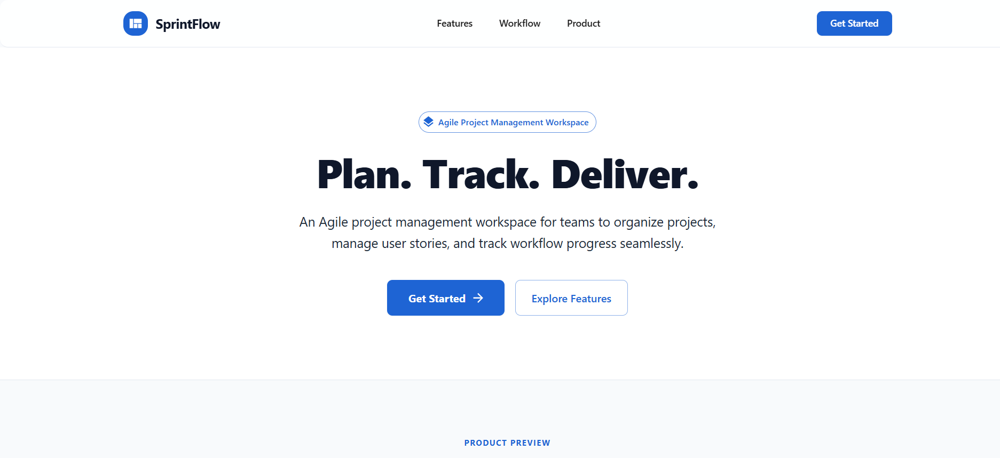
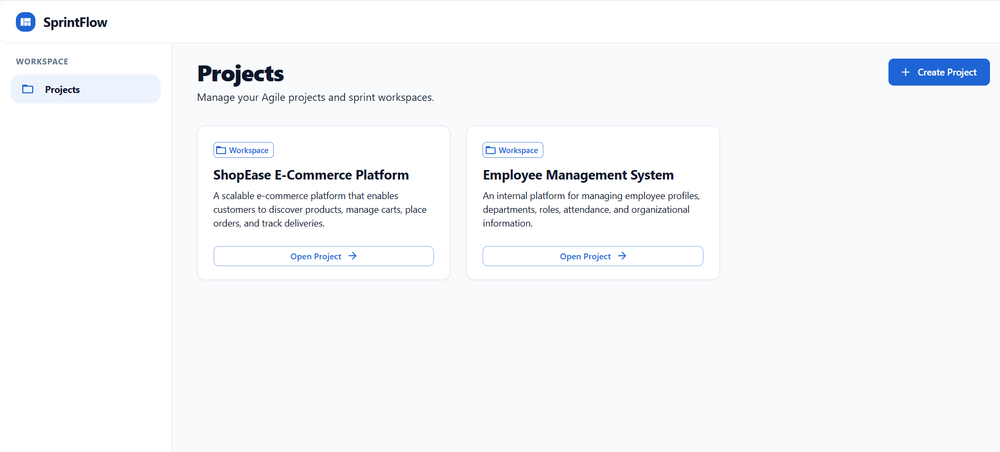
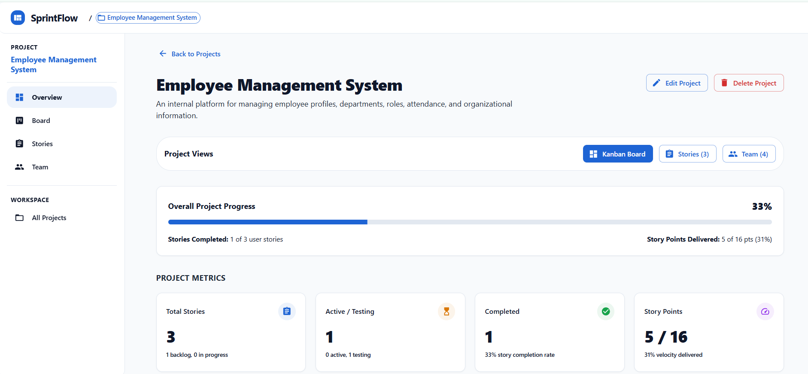
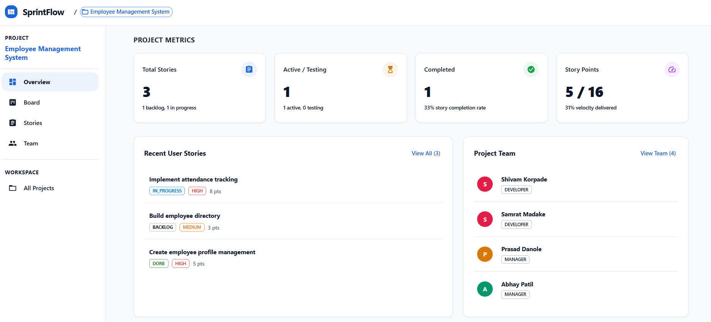
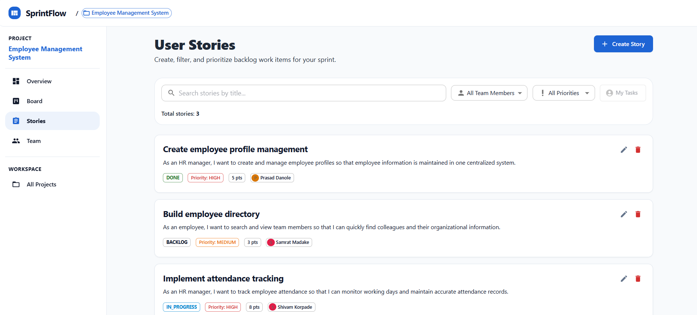
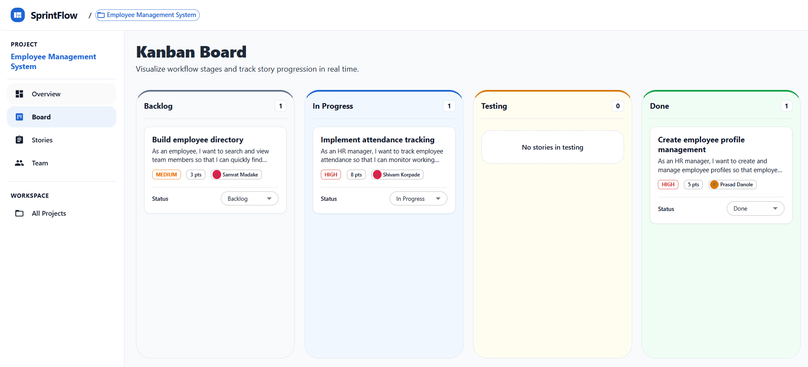
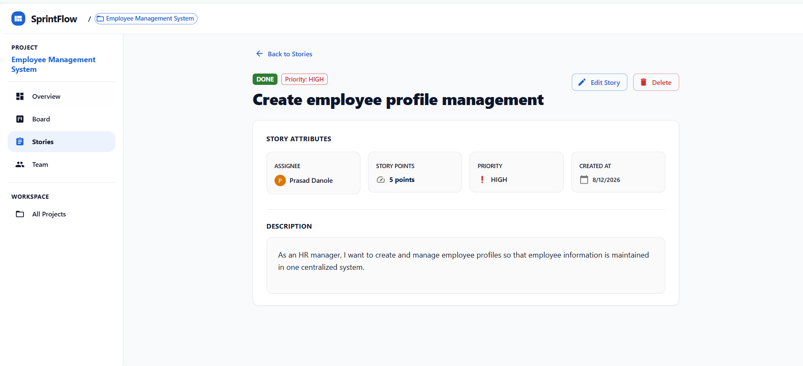
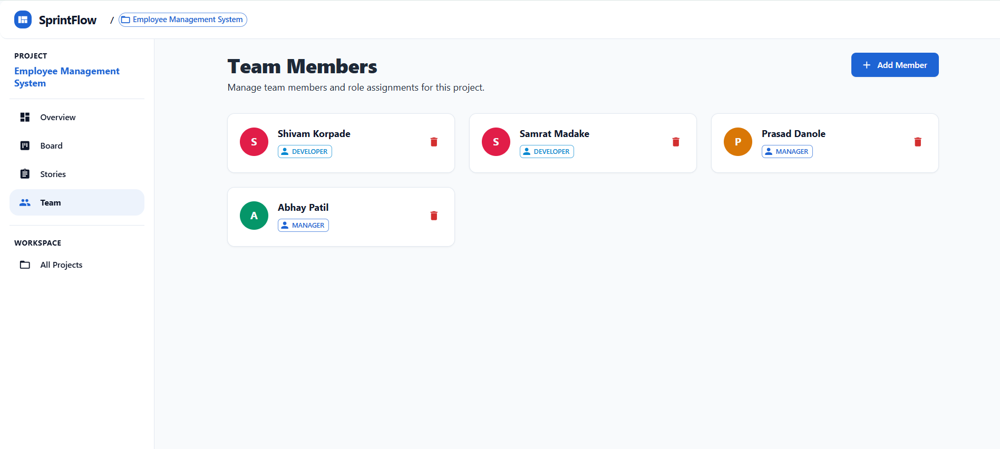
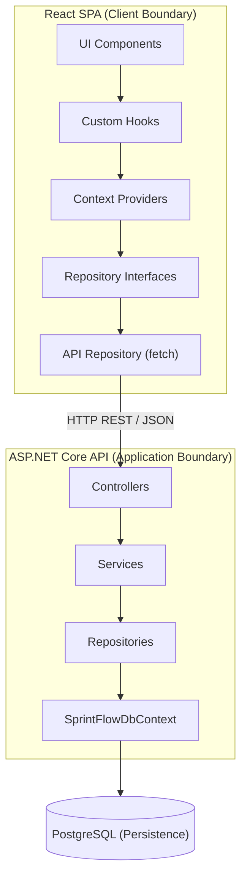
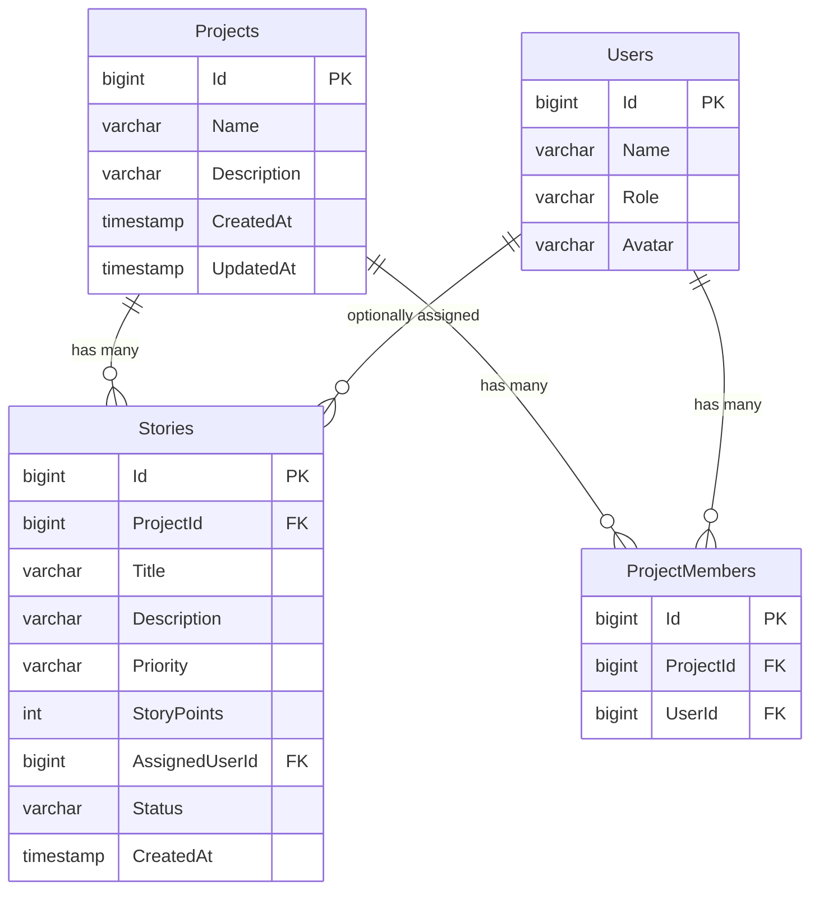

<div align="center">

# 🚀 SprintFlow

### Agile Project Management Platform

[](https://dotnet.microsoft.com/)
[](https://react.dev/)
[](https://www.typescriptlang.org/)
[](https://www.postgresql.org/)
[](https://learn.microsoft.com/en-us/ef/core/)
[](https://mui.com/)
[](https://vite.dev/)

**Plan. Track. Deliver.**

A full-stack Agile project management platform enabling teams to manage projects, author user stories, track sprint progress on an interactive Kanban board, and monitor delivery velocity — backed by a persistent PostgreSQL database with enforced business rules and referential integrity.

[Features](#-features) · [Architecture](#-system-architecture--design) · [API Overview](#-api-overview) · [Database](#-database) · [Getting Started](#-getting-started) · [Documentation](#-documentation)

</div>

---

## 📸 Product Preview

### Landing Page



### Projects Workspace



### Project Dashboard

<p align="center">
  
  
</p>

### Stories & Kanban Board

<p align="center">
  
  
</p>

### Story Detail & Team Management

<p align="center">
  
  
</p>

---

## ✨ Features

### Core Platform

- **Project Management** — Full CRUD with dashboard metrics, completion tracking, and story points velocity
- **User Stories** — Create, edit, delete stories with priority (`HIGH` · `MEDIUM` · `LOW`), story points (1–100), and 4-stage workflow
- **Kanban Board** — Drag-and-drop cards between **Backlog** → **In Progress** → **Testing** → **Done** columns with API-backed persistence
- **Team Management** — Add/remove system users as project members with duplicate prevention and role-based membership (`DEVELOPER` · `TESTER` · `MANAGER`)
- **Story Assignment** — Assign stories only to verified project team members, enforced by backend business rules
- **Project Dashboard** — Live KPI metrics, completion percentage, story points velocity, recent stories, and team summary

### Search & Filters

- Real-time title search (case-insensitive) with URL query parameter synchronization
- Filter by assignee and priority level with active filter chips

### UX

- Responsive layout — permanent sidebar on desktop, drawer toggle on mobile
- Contextual sidebar adapts to current project context with dynamic breadcrumbs
- Loading spinners, empty states, error alerts, and smooth transitions

---

## 🛠️ Tech Stack

| Layer | Technologies |
|---|---|
| **Frontend** | React 19, TypeScript 6, Vite 8, Material UI 9, Emotion 11, React Router 8 |
| **Backend** | ASP.NET Core (.NET 10), Entity Framework Core 10, Npgsql |
| **Database** | PostgreSQL |
| **Tooling** | ESLint, EF Core Migrations, dotnet CLI |

---

## 🏗️ System Architecture & Design

SprintFlow is engineered with a **layered full-stack architecture** enforcing strict separation of concerns, transactional consistency, and referential integrity:

- **Layered Architecture** — Downward-only dependencies across Presentation, Business, Data Access, and Persistence tiers.
- **Service / Repository Separation** — Domain rules (story assignments, duplicate prevention) reside in Services; EF Core data access resides in Repositories.
- **REST API with DTO Isolation** — Strongly typed request/response contracts decoupled from internal database models.
- **PostgreSQL Persistence** — Enforced foreign keys, unique indexes, and declarative delete behaviors (`CASCADE`, `SET NULL`).
- **Frontend Repository Abstraction** — Decouples the React UI from the HTTP transport via TypeScript interfaces.
- **Comprehensive UML & Data-Flow Models** — End-to-end trace from DOM events to SQL execution.



### Engineering Highlights

| Principle | Implementation |
|---|---|
| **Controller → Service → Repository** | Controllers handle HTTP binding, services own all business logic and validation, repositories handle EF Core data access |
| **Dependency Injection** | All components registered as **Scoped** — one DbContext per HTTP request, preventing captive dependencies |
| **Repository Pattern (both layers)** | TypeScript interfaces with `Api*Repository` implementations (frontend) and `I*Repository` / `*Repository` (backend) |
| **DTO Isolation** | Request/response DTOs are separate from domain entities — API contracts don't leak persistence details |
| **EF Core Transaction Semantics** | `SaveChangesAsync()` wraps all pending changes in an implicit transaction. Explicit `BeginTransactionAsync()` reserved for multi-step workflows |
| **CancellationToken Propagation** | Flows from HTTP request → Controller → Service → Repository → EF Core async operations |
| **Enum String Serialization** | `JsonStringEnumConverter` (API) + EF Core value conversions (DB) — human-readable strings everywhere |
| **Feature-Based Frontend** | Each domain (projects, stories, board, team) owns its components, context, hooks, and types |
| **URL as State** | Search filters and route parameters stored in URL via React Router — bookmarkable, shareable, back-button friendly |
| **Referential Integrity** | FK constraints with Cascade Delete (project → stories) and SetNull (user → story assignment) enforced at the database level |

> 📖 **Deep dive:** [docs/architecture.md](docs/architecture.md) — Layer analysis & design rationale · [docs/diagrams.md](docs/diagrams.md) — 18 UML, sequence & data-flow diagrams

---

## 📡 API Overview

17 REST endpoints across 4 controllers. All enum values serialized as strings. Numeric `long` IDs throughout.

| Resource | Endpoints | Key Operations |
|---|---|---|
| **Projects** | `GET` `POST` `PUT` `DELETE` `/api/projects` | Full CRUD, cascade delete to stories/members |
| **Users** | `GET` `POST` `PUT` `DELETE` `/api/users` | Full CRUD, delete sets story assignments to null |
| **Stories** | `GET` `POST` `PUT` `DELETE` `/api/projects/{id}/stories`, `/api/stories/{id}` | Full CRUD, assignee validation (must be project member) |
| **Members** | `GET` `POST` `DELETE` `/api/projects/{id}/members` | Add/remove/list with `409 Conflict` for duplicates |

> 📖 **Full reference:** [docs/api.md](docs/api.md) — Every endpoint with request/response payloads, validation rules, status codes, and business rules

---

## 🗄️ Database

4 PostgreSQL tables with enforced referential integrity:



| Relationship | Delete Behavior | Rationale |
|---|---|---|
| Story → Project | Cascade | Stories cannot exist without a project |
| Story → User (assignment) | SetNull | Deleting a user clears assignments, preserves stories |
| ProjectMember → Project/User | Cascade | Removing a project or user cleans up memberships |

**Unique index** on `ProjectMembers(ProjectId, UserId)` prevents duplicate memberships at the database level.

> 📖 **Full schema:** [docs/database.md](docs/database.md) — Complete table definitions, constraints, enum storage, and migration documentation

---

## 🚀 Getting Started

### Prerequisites

- **.NET SDK 10.0+** · **Node.js 18+** · **npm 9+** · **PostgreSQL 14+**

### Quick Start

```bash
# Clone
git clone https://github.com/shivamkorpade985/SprintFlow-Agile-Project-Management-Platform.git
cd SprintFlow-Agile-Project-Management-Platform

# Database
# Create a PostgreSQL database named "SprintFlow"
# Update connection string in backend/SprintFlowAPI/appsettings.json

# Backend
cd backend/SprintFlowAPI
dotnet ef database update          # Apply migrations
dotnet run --launch-profile http   # API on http://localhost:5000

# Frontend (new terminal)
cd frontend
npm install
cp .env.example .env               # VITE_API_BASE_URL=http://localhost:5000
npm run dev                        # App on http://localhost:5173
```

> 📖 **Detailed setup:** [docs/development.md](docs/development.md) — Complete setup guide with troubleshooting

---

## 🗺️ Route Map

| Path | Page | Description |
|---|---|---|
| `/` | Landing | Public marketing page with hero and CTA |
| `/projects` | Projects | Workspace project listing and creation |
| `/projects/:projectId` | Dashboard | Project overview with KPI metrics |
| `/projects/:projectId/board` | Kanban Board | Drag-and-drop workflow board |
| `/projects/:projectId/stories` | Stories | Filterable story backlog with search |
| `/projects/:projectId/stories/:storyId` | Story Detail | Full story view with inline editing |
| `/projects/:projectId/team` | Team | Project team membership management |
| `/projects/:projectId/team/:userId` | User Detail | Team member profile |

---

## 🧩 Project Structure

```
SprintFlow-Agile-Project-Management-Platform/
├── README.md
├── docs/
│   ├── architecture.md              # System architecture & design
│   ├── diagrams.md                  # System & UML diagrams
│   ├── api.md                       # REST API reference
│   ├── database.md                  # PostgreSQL schema
│   ├── development.md               # Setup guide
│   └── testing.md                   # Testing procedures
│
├── backend/SprintFlowAPI/
│   ├── Program.cs                   # DI, CORS, middleware pipeline
│   ├── Controllers/                 # HTTP endpoint binding (4 controllers)
│   ├── Services/                    # Business logic & validation (4 services)
│   ├── Repositories/                # EF Core data access (4 repositories)
│   ├── Models/                      # Entity models & enums
│   ├── DTOs/                        # Request/response contracts (11 DTOs)
│   ├── Data/                        # SprintFlowDbContext
│   ├── Middleware/                   # GlobalExceptionMiddleware
│   └── Migrations/                  # EF Core migrations
│
└── frontend/src/
    ├── app/                         # Router, layouts, theme
    ├── features/                    # Feature modules (landing, projects, stories, board, team)
    ├── repositories/                # Repository interfaces + API/local implementations
    ├── storage/                     # LocalStorage wrapper
    └── constants/                   # Storage keys
```

---

## 📚 Documentation

| Document | Description |
|---|---|
| [System Architecture](docs/architecture.md) | Layered architecture, backend tiers, DI lifetime analysis, EF Core transactions, frontend state |
| [System & UML Diagrams](docs/diagrams.md) | 18 visual models — system context, sequence flows, ERD, component, and runtime topology |
| [API Reference](docs/api.md) | Complete REST API — all 17 endpoints with payloads, validation, status codes, business rules |
| [Database Design](docs/database.md) | PostgreSQL schema, ER diagram, constraints, delete behaviors, enum storage, migrations |
| [Development Guide](docs/development.md) | Prerequisites, backend/frontend setup, environment configuration, troubleshooting |
| [Testing & Verification](docs/testing.md) | Build verification, Postman test scenarios, integration verification, business rule testing |

---

## 🔮 Future Enhancements

- [ ] **Authentication & Authorization** — User login, session management, role-based access control
- [ ] **Sprint Management** — Time-boxed sprint containers with burndown charts
- [ ] **Docker Containerization** — Dockerfile and docker-compose for streamlined deployment
- [ ] **CI/CD Pipeline** — Automated build, test, and deployment workflows
- [ ] **Automated Testing** — Unit tests, integration tests, and end-to-end tests
- [ ] **Cloud Deployment** — Production deployment to Azure, AWS, or similar

---

## 📄 License

This project is part of an academic engineering portfolio. All rights reserved.

---

<div align="center">

## 👤 Author

**Shivam Korpade**

[](https://github.com/shivamkorpade985)

---

*Built with ❤️ using React, ASP.NET Core, and PostgreSQL*

</div>