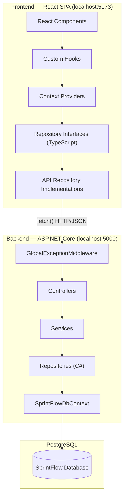

# SprintFlow — System Architecture

> This document explains the complete technical architecture of SprintFlow, derived from the actual implementation.

---

## Table of Contents

- [High-Level System Architecture](#high-level-system-architecture)
- [Backend Architecture](#backend-architecture)
  - [Request Lifecycle](#request-lifecycle)
  - [Controllers](#controllers)
  - [Services](#services)
  - [Repositories](#repositories)
  - [SprintFlowDbContext](#sprintflowdbcontext)
  - [Middleware](#middleware)
- [Dependency Injection](#dependency-injection)
- [EF Core Transaction Strategy](#ef-core-transaction-strategy)
- [CancellationToken Propagation](#cancellationtoken-propagation)
- [Enum Serialization](#enum-serialization)
- [Frontend Architecture](#frontend-architecture)
  - [Feature-Based Organization](#feature-based-organization)
  - [Data Flow](#data-flow)
  - [Context Providers](#context-providers)
  - [Repository Abstraction](#repository-abstraction)
  - [Routing](#routing)
  - [State Management](#state-management)
- [Frontend ↔ Backend Integration](#frontend--backend-integration)
- [CORS Configuration](#cors-configuration)

---

## High-Level System Architecture

SprintFlow is a full-stack application consisting of a **React SPA** frontend communicating over **HTTP REST** with an **ASP.NET Core** backend, persisting data to **PostgreSQL**.



There are no message queues, background workers, caches, or external services. The system is a synchronous request-response architecture.

---

## Backend Architecture

### Request Lifecycle

Every HTTP request follows this exact path through the backend:

```
HTTP Request (from React frontend)
     │
     ▼
GlobalExceptionMiddleware        ← Catches unhandled exceptions, returns 500 JSON
     │
     ▼
CORS Middleware                  ← Validates origin against AllowFrontendApp policy
     │
     ▼
Controller                       ← Binds request, calls service, maps HTTP response
     │
     ▼
Service                          ← Business logic, validation, DTO ↔ entity mapping
     │
     ▼
Repository                       ← EF Core queries, SaveChangesAsync()
     │
     ▼
SprintFlowDbContext              ← Change tracking, Unit of Work
     │
     ▼
PostgreSQL                       ← Persistent storage
```

### Controllers

**Location:** `Controllers/`  
**Files:** `ProjectsController.cs`, `UsersController.cs`, `StoriesController.cs`, `ProjectMembersController.cs`

Controllers are **thin** — they handle only HTTP concerns:

| Responsibility | Example |
|---|---|
| Request binding | `[FromBody] CreateProjectRequest request` |
| Model validation | `if (!ModelState.IsValid) return BadRequest(ModelState)` |
| Service delegation | `await _projectService.CreateAsync(request, cancellationToken)` |
| HTTP status mapping | `return CreatedAtAction(...)`, `return NotFound(...)`, `return NoContent()` |
| Exception translation | `catch (KeyNotFoundException) → 404`, `catch (InvalidOperationException) → 400/409` |

Controllers depend **only** on service interfaces (`IProjectService`, `IStoryService`, etc.), never on repositories directly.

All controllers use `[ApiController]` and `[Produces("application/json")]` attributes. Route templates are defined via `[Route("api/projects")]` or inline `[HttpGet("api/stories/{id:long}")]`.

### Services

**Location:** `Services/`  
**Files:** `ProjectService.cs`, `UserService.cs`, `StoryService.cs`, `ProjectMemberService.cs`  
**Interfaces:** `IProjectService.cs`, `IUserService.cs`, `IStoryService.cs`, `IProjectMemberService.cs`

Services own **all business rules and domain validation**:

| Responsibility | Example |
|---|---|
| Business validation | `StoryService.ValidateAssigneeForProjectAsync()` checks user exists AND is a project member |
| Cross-entity rules | Story assignee must be a member of the story's project |
| DTO → Entity mapping | `CreateProjectRequest` → `Project` entity |
| Entity → DTO mapping | `Project` entity → `ProjectResponse` DTO |
| Orchestration | `ProjectMemberService` validates project exists, user exists, no duplicate, then delegates to repository |
| Structured logging | `_logger.LogInformation("Project {ProjectId} created.", ...)` |

**Key business rules enforced by services:**

1. **Story assignment** — `StoryService` validates that the `AssignedUserId` refers to a user that (a) exists and (b) is a member of the story's project. This is enforced on both create and update.
2. **Duplicate membership prevention** — `ProjectMemberService` checks `IsMemberAsync()` before adding a member and throws `InvalidOperationException` if already a member.
3. **Entity existence validation** — All services validate that parent entities exist before operating (e.g., project must exist before listing its stories).

### Repositories

**Location:** `Repositories/`  
**Files:** `ProjectRepository.cs`, `UserRepository.cs`, `StoryRepository.cs`, `ProjectMemberRepository.cs`  
**Interfaces:** `IProjectRepository.cs`, `IUserRepository.cs`, `IStoryRepository.cs`, `IProjectMemberRepository.cs`

Repositories contain **data access logic only** — no business rules:

| Responsibility | Example |
|---|---|
| LINQ queries | `_context.Stories.Where(s => s.ProjectId == projectId).OrderByDescending(s => s.CreatedAt)` |
| Entity persistence | `_context.Projects.AddAsync(project); await _context.SaveChangesAsync()` |
| `AsNoTracking()` for reads | Read queries use `AsNoTracking()` for performance since returned entities are not modified |
| Navigation property loading | `ProjectMemberRepository.GetMembersByProjectIdAsync()` uses `.Include(pm => pm.User)` |
| Support queries for services | `IStoryRepository` exposes `ProjectExistsAsync()`, `UserExistsAsync()`, `IsUserMemberOfProjectAsync()` for use by `StoryService` |

**Important pattern:** `IStoryRepository` includes support queries (`ProjectExistsAsync`, `UserExistsAsync`, `IsUserMemberOfProjectAsync`) that provide raw data access. The **service** interprets and applies the business rules using these results. The repository does not enforce any business logic.

### SprintFlowDbContext

**Location:** `Data/SprintFlowDbContext.cs`

The DbContext is the EF Core entry point for all database operations:

| Responsibility | Details |
|---|---|
| `DbSet` properties | `Projects`, `Users`, `Stories`, `ProjectMembers` |
| Fluent API configuration | Entity keys, column constraints, relationships, delete behaviors, value conversions |
| Change tracking | Tracks entity modifications until `SaveChangesAsync()` is called |
| Unit of Work | One DbContext instance per HTTP request, coordinating all changes within that request |

Key Fluent API configurations:
- **Unique index** on `ProjectMembers(ProjectId, UserId)` — prevents duplicate memberships at the database level
- **Cascade delete** on Story → Project and ProjectMember → Project/User
- **SetNull** on Story → AssignedUser (deleting a user clears assignments, not stories)
- **String value conversion** for `StoryPriority` and `StoryStatus` enums — stored as `"BACKLOG"`, `"HIGH"`, etc. in PostgreSQL

### Middleware

**Location:** `Middleware/GlobalExceptionMiddleware.cs`

A single custom middleware handles unhandled exceptions:

```csharp
catch (Exception ex)
{
    _logger.LogError(ex, "An unhandled exception occurred...");
    // Returns HTTP 500 with: { "message": "An unexpected server error occurred..." }
}
```

This ensures that no internal details (stack traces, connection strings, entity names) leak to API consumers. Expected business exceptions (`KeyNotFoundException`, `InvalidOperationException`) are caught at the controller level and translated to appropriate HTTP status codes.

---

## Dependency Injection

All registrations are in `Program.cs`. The lifetime choices are intentional and documented in code comments:

```
DbContext     → Scoped    (one instance per HTTP request)
Repositories  → Scoped    (share the same DbContext instance)
Services      → Scoped    (share the same repositories and DbContext)
```

### Why Scoped?

1. **DbContext is not thread-safe.** A Scoped lifetime creates one instance per HTTP request, preventing concurrent access and state corruption.

2. **Captive dependency prevention.** A Scoped service cannot be safely injected into a Singleton. Since DbContext is Scoped, all consumers (repositories and services) must also be Scoped to avoid capturing a disposed DbContext.

3. **Unit of Work scope.** All repositories participating in one HTTP request share the same DbContext instance. This means changes tracked by one repository are visible to another repository within the same request — a prerequisite for consistent business rule enforcement.

### Why not Singleton?

A Singleton DbContext would be shared across all concurrent requests. Since DbContext is not thread-safe, this would cause data corruption, connection leaks, and race conditions.

### Why not Transient?

A Transient DbContext would create a new instance for each injection point. Repositories in the same request would get different DbContext instances with independent change trackers, breaking the Unit of Work guarantee.

---

## EF Core Transaction Strategy

SprintFlow relies on EF Core's built-in transaction behavior within `SaveChangesAsync()`. This is an intentional engineering decision.

### How SaveChangesAsync() Works

When `SaveChangesAsync()` is called:

1. EF Core opens a database connection (if not already open).
2. EF Core begins an **implicit database transaction**.
3. All pending INSERT, UPDATE, DELETE operations are sent to PostgreSQL within that transaction.
4. If all operations succeed, the transaction is **committed**.
5. If any operation fails, the transaction is **rolled back** — no partial writes.

**Result:** Multiple entity modifications tracked by the same DbContext and flushed in one `SaveChangesAsync()` call are persisted **atomically**.

### Current Usage Pattern

In SprintFlow, each repository method typically calls `SaveChangesAsync()` after its operation:

```csharp
await _context.Stories.AddAsync(story, cancellationToken);
await _context.SaveChangesAsync(cancellationToken);
```

This is correct for single-entity operations. EF Core wraps each `SaveChangesAsync()` in its own implicit transaction.

### Explicit Transactions

For workflows requiring atomicity across **multiple** `SaveChangesAsync()` calls, EF Core provides explicit transaction control:

```csharp
await using var transaction = await _context.Database.BeginTransactionAsync();
try
{
    // ... multiple SaveChangesAsync() calls ...
    await transaction.CommitAsync();
}
catch
{
    await transaction.RollbackAsync();
    throw;
}
```

SprintFlow's current CRUD operations do not require explicit transactions because each operation involves a single `SaveChangesAsync()` call. The implicit transaction inside `SaveChangesAsync()` provides sufficient atomicity.

### CancellationToken vs. Database Transaction

These are **fundamentally different concepts**:

| Concept | Purpose | Mechanism |
|---|---|---|
| **CancellationToken** | Cooperative cancellation of async work | If the HTTP client disconnects, the token signals cancellation; the async operation can check and abort early |
| **Database Transaction** | Atomicity of database writes | Ensures all-or-nothing persistence; on failure, all changes are rolled back |

`CancellationToken` does **not** provide commit/rollback semantics. It is passed through the call chain (`Controller → Service → Repository → EF Core`) to allow early termination of long-running queries if the HTTP request is cancelled. The database transaction is managed independently by EF Core.

---

## CancellationToken Propagation

Every async method in SprintFlow accepts and propagates `CancellationToken`:

```
Controller method parameter (from ASP.NET Core)
     ↓
Service method parameter
     ↓
Repository method parameter
     ↓
EF Core async methods (ToListAsync, SaveChangesAsync, AnyAsync, etc.)
```

ASP.NET Core automatically provides a `CancellationToken` linked to the HTTP request lifecycle. If the client disconnects, the token is cancelled, and EF Core can abort in-flight database queries.

---

## Enum Serialization

SprintFlow uses three C# enums: `UserRole`, `StoryPriority`, `StoryStatus`.

**Problem:** `System.Text.Json` serializes enums as integers by default (`0`, `1`, `2`). The frontend expects string literals (`"DEVELOPER"`, `"HIGH"`, `"BACKLOG"`).

**Solution:** `JsonStringEnumConverter` is registered globally in `Program.cs`:

```csharp
builder.Services.AddControllers()
    .AddJsonOptions(options =>
    {
        options.JsonSerializerOptions.Converters.Add(new JsonStringEnumConverter());
    });
```

**Database storage:** `StoryPriority` and `StoryStatus` are stored as strings in PostgreSQL via EF Core value conversions (`.HasConversion<string>()`). `UserRole` is stored as a plain `varchar` string on the `User.Role` property (the service converts the enum to string via `.ToString()`).

---

## Frontend Architecture

### Feature-Based Organization

The frontend is organized by domain feature, not by technical role:

```
features/
├── landing/        # Public landing page
│   └── components/
├── projects/       # Project CRUD + dashboard
│   ├── components/
│   ├── context/
│   ├── hooks/
│   ├── types/
│   └── projectRepository.ts
├── stories/        # Story CRUD + filters
│   ├── components/
│   ├── context/
│   ├── hooks/
│   ├── types/
│   └── storyRepository.ts
├── board/          # Kanban board
│   ├── components/
│   └── types/
└── team/           # Team membership + user profiles
    ├── components/
    ├── constants/
    ├── context/
    ├── data/
    ├── hooks/
    ├── types/
    ├── userRepository.ts
    └── projectMemberRepository.ts
```

Each feature module owns its components, state management (context/provider), hooks, types, and repository instance. This isolation means changes to one feature do not cascade across unrelated features.

### Data Flow

```
React Component (e.g., StoriesPage)
     │  calls
     ▼
Custom Hook (useStories)
     │  reads from
     ▼
React Context (StoriesContext)
     │  provided by
     ▼
Provider (StoriesProvider)
     │  delegates to
     ▼
Repository Instance (storyRepository)
     │  which is
     ▼
ApiStoryRepository (concrete implementation)
     │  sends
     ▼
fetch() → HTTP REST API (ASP.NET Core backend)
     │
     ▼
PostgreSQL
```

### Context Providers

Three Context Providers manage domain state:

| Provider | Scope | Mounted At | State |
|---|---|---|---|
| `ProjectsProvider` | Global (all `/projects/*` routes) | `AppLayout` | `projects[]`, `isLoading`, `error` |
| `StoriesProvider` | Project-scoped | `ProjectOverviewPage`, `BoardPage`, `StoriesPage` | `stories[]`, `isLoading`, `error` |
| `ProjectTeamProvider` | Project-scoped | `ProjectOverviewPage`, `BoardPage`, `TeamPage` | `members[]`, `isLoading`, `error` |

**Key design:** `StoriesProvider` and `ProjectTeamProvider` receive a `projectId` prop and reload data when the project changes. They are mounted at the page level (not in `AppLayout`) because they are project-scoped — each project has its own stories and team members.

Each provider:
1. Loads data on mount via the repository
2. Exposes CRUD functions (`createStory`, `updateStory`, `deleteStory`, etc.)
3. Updates local state after successful API calls (optimistic local update)
4. Exposes `isLoading` and `error` states for UI feedback

### Repository Abstraction

The frontend uses the **Repository Pattern** with TypeScript interfaces:

```
repositories/
├── ProjectRepository.ts           # Interface
├── StoryRepository.ts             # Interface
├── UserRepository.ts              # Interface
├── ProjectMemberRepository.ts     # Interface
├── api/                           # API implementations (active)
│   ├── ApiProjectRepository.ts
│   ├── ApiStoryRepository.ts
│   ├── ApiUserRepository.ts
│   └── ApiProjectMemberRepository.ts
└── local/                         # LocalStorage implementations (fallback)
    ├── LocalStorageProjectRepository.ts
    ├── LocalStorageStoryRepository.ts
    ├── LocalStorageUserRepository.ts
    └── LocalStorageProjectMemberRepository.ts
```

**Current wiring:** All four domain features are wired to **API repositories**:

| Module File | Wired To |
|---|---|
| `features/projects/projectRepository.ts` | `new ApiProjectRepository()` |
| `features/stories/storyRepository.ts` | `new ApiStoryRepository()` |
| `features/team/userRepository.ts` | `new ApiUserRepository()` |
| `features/team/projectMemberRepository.ts` | `new ApiProjectMemberRepository()` |

The `LocalStorage*Repository` implementations still exist in the codebase as a fallback option but are **not currently used**. Swapping between implementations requires changing only the single import in each module-level repository file.

**Note:** `main.tsx` still calls `initializeTeamData()` which seeds localStorage with default users. This is a legacy remnant from before backend integration and has no effect on the active API repositories.

### Routing

React Router v8 (`react-router` package) provides client-side routing:

| Path | Layout | Page Component | Providers Mounted |
|---|---|---|---|
| `/` | `LandingLayout` | `LandingPage` | None |
| `/projects` | `AppLayout` | `ProjectsPage` | `ProjectsProvider` (from AppLayout) |
| `/projects/:projectId` | `AppLayout` | `ProjectOverviewPage` | `ProjectsProvider` + `StoriesProvider` + `ProjectTeamProvider` |
| `/projects/:projectId/board` | `AppLayout` | `BoardPage` | `ProjectsProvider` + `StoriesProvider` + `ProjectTeamProvider` |
| `/projects/:projectId/stories` | `AppLayout` | `StoriesPage` | `ProjectsProvider` + `StoriesProvider` + `ProjectTeamProvider` |
| `/projects/:projectId/stories/:storyId` | `AppLayout` | `StoryDetailPage` | `ProjectsProvider` + `StoriesProvider` + `ProjectTeamProvider` |
| `/projects/:projectId/team` | `AppLayout` | `TeamPage` | `ProjectsProvider` + `ProjectTeamProvider` |
| `/projects/:projectId/team/:userId` | `AppLayout` | `UserDetailPage` | `ProjectsProvider` + `ProjectTeamProvider` |

### State Management

SprintFlow uses **React Context + Providers** for domain state. No external state management libraries (Redux, Zustand, etc.) are used.

| Category | Examples | Location |
|---|---|---|
| **Domain State** | `projects[]`, `stories[]`, `members[]` | Context Providers |
| **Derived State** | Kanban columns, dashboard metrics, filtered stories | Computed during render |
| **UI State** | Dialog open/close, loading flags, form drafts, drag highlight | Component `useState` |
| **URL State** | `projectId`, `storyId`, search & filter query params | React Router (`useParams`, `useSearchParams`) |
| **Persistent State** | All domain entities | PostgreSQL via REST API |

---

## Frontend ↔ Backend Integration

### API Base URL

The frontend reads `VITE_API_BASE_URL` from the environment (`.env` file):

```
VITE_API_BASE_URL=http://localhost:5000
```

Each API repository reads this at construction time:

```typescript
this.baseUrl =
  baseUrl ??
  (import.meta.env.VITE_API_BASE_URL as string | undefined) ??
  "http://localhost:5000";
```

### Request/Response Pattern

All API repositories use the native `fetch()` API:

```typescript
// GET example
const response = await fetch(`${this.baseUrl}/api/projects`, {
  method: "GET",
  headers: { Accept: "application/json" },
});

// POST example
const response = await fetch(`${this.baseUrl}/api/projects`, {
  method: "POST",
  headers: {
    "Content-Type": "application/json",
    Accept: "application/json",
  },
  body: JSON.stringify(data),
});
```

### Error Handling

API repositories handle errors by checking `response.ok` and throwing descriptive `Error` objects:

```typescript
if (response.status === 404) {
  return null; // or throw new Error("Not found")
}
if (!response.ok) {
  const errorText = await response.text();
  throw new Error(`Failed to fetch: ${response.status} ${response.statusText} - ${errorText}`);
}
```

Context Providers catch these errors and surface them via the `error` state property, which components display using MUI `Alert` components.

### ID Type Compatibility

Both frontend (`number`) and backend (`long`) use 64-bit numeric identifiers. The JSON serialization naturally maps between JavaScript's `number` and C#'s `long`. All IDs are auto-generated by PostgreSQL (`BIGINT GENERATED BY DEFAULT AS IDENTITY`).

---

## CORS Configuration

CORS is configured in `Program.cs` with a named policy `"AllowFrontendApp"`:

```csharp
policy.WithOrigins(
    "http://localhost:5173",    // Vite dev server
    "http://localhost:3000",    // Alternative dev port
    "http://127.0.0.1:5173"    // Loopback variant
)
.AllowAnyHeader()
.AllowAnyMethod();
```

This allows the React development server to make cross-origin requests to the backend API during development.
