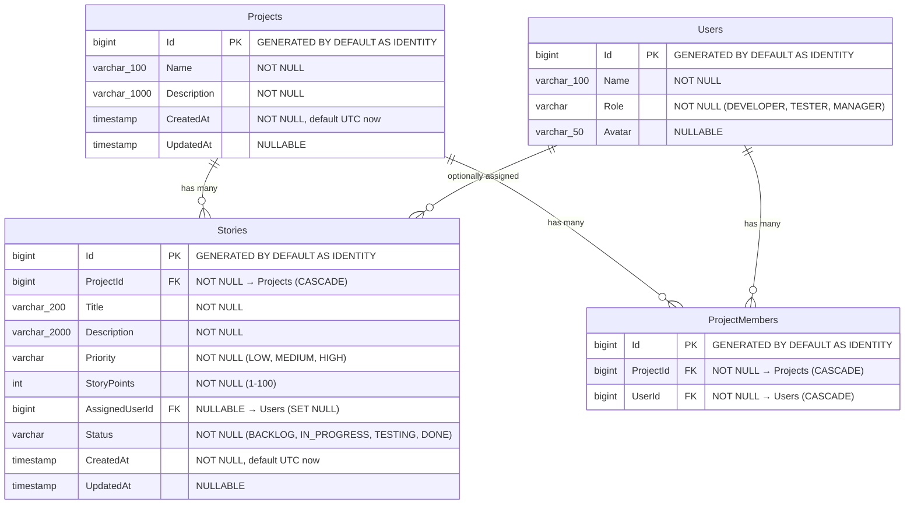

# SprintFlow — Database Design

> PostgreSQL schema documentation derived from the actual EF Core `SprintFlowDbContext`, entity models, Fluent API configuration, and migration files.

**Related Documentation:**
- [Architecture](./architecture.md) — EF Core transaction strategy, DbContext lifetime, Unit of Work
- [API Reference](./api.md) — How the database schema maps to API request/response DTOs

---

## Table of Contents

- [Overview](#overview)
- [Entity Relationship Diagram](#entity-relationship-diagram)
- [Tables](#tables)
  - [Projects](#projects)
  - [Users](#users)
  - [Stories](#stories)
  - [ProjectMembers](#projectmembers)
- [Relationships](#relationships)
- [Delete Behaviors](#delete-behaviors)
- [Constraints and Indexes](#constraints-and-indexes)
- [Enum Storage](#enum-storage)
- [Primary Key Strategy](#primary-key-strategy)
- [Timestamps](#timestamps)
- [EF Core Migrations](#ef-core-migrations)

---

## Overview

SprintFlow uses **PostgreSQL** as its relational database, accessed through **Entity Framework Core 10** with the **Npgsql** provider.

The database contains **4 tables** modeling the core domain:

| Table | Entity | Purpose |
|---|---|---|
| `Projects` | `Project` | Agile projects |
| `Users` | `User` | System-level users with roles |
| `Stories` | `Story` | User stories belonging to projects |
| `ProjectMembers` | `ProjectMember` | Many-to-many join table (Project ↔ User) |

All schema configuration is defined via **Fluent API** in `SprintFlowDbContext.OnModelCreating()`, not via Data Annotations on entities. This keeps entity classes clean and consolidates all database mapping rules in one location.

---

## Entity Relationship Diagram



---

## Tables

### Projects

Represents an Agile project — the top-level organizing entity.

| Column | PostgreSQL Type | Nullable | Default | Constraint |
|---|---|---|---|---|
| `Id` | `bigint` | No | Auto-generated (identity) | Primary Key |
| `Name` | `varchar(100)` | No | — | Required, max 100 chars |
| `Description` | `varchar(1000)` | No | — | Required, max 1000 chars |
| `CreatedAt` | `timestamp with time zone` | No | Set to `DateTime.UtcNow` by repository | — |
| `UpdatedAt` | `timestamp with time zone` | Yes | `null` | Set on update by repository |

**C# Entity:** `Models/Project.cs`

```csharp
public class Project
{
    public long Id { get; set; }
    public string Name { get; set; }
    public string Description { get; set; }
    public DateTime CreatedAt { get; set; }
    public DateTime? UpdatedAt { get; set; }
    public ICollection<Story> Stories { get; set; }
    public ICollection<ProjectMember> ProjectMembers { get; set; }
}
```

---

### Users

Represents a system-level user who can be added to project teams and assigned to stories.

| Column | PostgreSQL Type | Nullable | Default | Constraint |
|---|---|---|---|---|
| `Id` | `bigint` | No | Auto-generated (identity) | Primary Key |
| `Name` | `varchar(100)` | No | — | Required, max 100 chars |
| `Role` | `varchar` | No | — | Stored as string (`"DEVELOPER"`, `"TESTER"`, `"MANAGER"`) |
| `Avatar` | `varchar(50)` | Yes | `null` | Hex color or preset name |

**C# Entity:** `Models/User.cs`

```csharp
public class User
{
    public long Id { get; set; }
    public string Name { get; set; }
    public string Role { get; set; }       // Stored as string, mapped from UserRole enum in service
    public string? Avatar { get; set; }
    public ICollection<ProjectMember> ProjectMemberships { get; set; }
    public ICollection<Story> AssignedStories { get; set; }
}
```

**Note:** `User.Role` is stored as a plain `varchar` string. The `UserRole` enum (`DEVELOPER`, `TESTER`, `MANAGER`) is defined in `Models/UserRole.cs` and used in DTOs for validation, but the `User` entity stores the role as a string. The service layer handles the conversion using `.ToString()`.

---

### Stories

Represents a User Story — a unit of work within a project, following the Agile workflow: `BACKLOG` → `IN_PROGRESS` → `TESTING` → `DONE`.

| Column | PostgreSQL Type | Nullable | Default | Constraint |
|---|---|---|---|---|
| `Id` | `bigint` | No | Auto-generated (identity) | Primary Key |
| `ProjectId` | `bigint` | No | — | Foreign Key → `Projects.Id` (CASCADE DELETE) |
| `Title` | `varchar(200)` | No | — | Required, max 200 chars |
| `Description` | `varchar(2000)` | No | — | Required, max 2000 chars |
| `Priority` | `varchar` | No | — | Value conversion: `StoryPriority` enum → string |
| `StoryPoints` | `integer` | No | — | Range: 1–100 |
| `AssignedUserId` | `bigint` | Yes | `null` | Foreign Key → `Users.Id` (SET NULL on delete) |
| `Status` | `varchar` | No | — | Value conversion: `StoryStatus` enum → string |
| `CreatedAt` | `timestamp with time zone` | No | Set to `DateTime.UtcNow` by repository | — |
| `UpdatedAt` | `timestamp with time zone` | Yes | `null` | Set on update by repository |

**C# Entity:** `Models/Story.cs`

```csharp
public class Story
{
    public long Id { get; set; }
    public long ProjectId { get; set; }
    public string Title { get; set; }
    public string Description { get; set; }
    public StoryPriority Priority { get; set; }      // Enum → stored as string
    public int StoryPoints { get; set; }
    public long? AssignedUserId { get; set; }
    public StoryStatus Status { get; set; }           // Enum → stored as string
    public DateTime CreatedAt { get; set; }
    public DateTime? UpdatedAt { get; set; }
    public Project Project { get; set; }              // Navigation property
    public User? AssignedUser { get; set; }           // Navigation property (nullable)
}
```

---

### ProjectMembers

Join table modeling the many-to-many relationship between Projects and Users. A row in this table means "User X is a member of Project Y."

| Column | PostgreSQL Type | Nullable | Default | Constraint |
|---|---|---|---|---|
| `Id` | `bigint` | No | Auto-generated (identity) | Primary Key |
| `ProjectId` | `bigint` | No | — | Foreign Key → `Projects.Id` (CASCADE DELETE) |
| `UserId` | `bigint` | No | — | Foreign Key → `Users.Id` (CASCADE DELETE) |

**Additional Constraint:** Unique index on `(ProjectId, UserId)` — prevents duplicate memberships.

**C# Entity:** `Models/ProjectMember.cs`

```csharp
public class ProjectMember
{
    public long Id { get; set; }
    public long ProjectId { get; set; }
    public long UserId { get; set; }
    public Project Project { get; set; }      // Navigation property
    public User User { get; set; }            // Navigation property
}
```

---

## Relationships

| Relationship | Type | FK Column | Navigation Properties |
|---|---|---|---|
| Project → Stories | One-to-Many | `Stories.ProjectId` | `Project.Stories` ↔ `Story.Project` |
| Project → ProjectMembers | One-to-Many | `ProjectMembers.ProjectId` | `Project.ProjectMembers` ↔ `ProjectMember.Project` |
| User → ProjectMembers | One-to-Many | `ProjectMembers.UserId` | `User.ProjectMemberships` ↔ `ProjectMember.User` |
| User → Stories (assignment) | One-to-Many (optional) | `Stories.AssignedUserId` | `User.AssignedStories` ↔ `Story.AssignedUser` |

**Effective many-to-many:** Projects ↔ Users is modeled as two one-to-many relationships through the `ProjectMembers` join table. This explicit join entity allows the `Id` primary key and enables direct querying of membership records.

---

## Delete Behaviors

Each foreign key relationship has an explicit delete behavior configured in EF Core:

| Relationship | FK | Delete Behavior | Rationale |
|---|---|---|---|
| Story → Project | `Stories.ProjectId` | **Cascade** | Deleting a project deletes all its stories — stories cannot exist without a project |
| Story → User | `Stories.AssignedUserId` | **SetNull** | Deleting a user clears story assignments but preserves the stories themselves |
| ProjectMember → Project | `ProjectMembers.ProjectId` | **Cascade** | Deleting a project removes all team memberships |
| ProjectMember → User | `ProjectMembers.UserId` | **Cascade** | Deleting a user removes all their project memberships |

**EF Core Fluent API configuration:**

```csharp
// Story → Project: Cascade delete
modelBuilder.Entity<Story>()
    .HasOne(s => s.Project)
    .WithMany(p => p.Stories)
    .HasForeignKey(s => s.ProjectId)
    .OnDelete(DeleteBehavior.Cascade);

// Story → User: SetNull on delete
modelBuilder.Entity<Story>()
    .HasOne(s => s.AssignedUser)
    .WithMany(u => u.AssignedStories)
    .HasForeignKey(s => s.AssignedUserId)
    .IsRequired(false)
    .OnDelete(DeleteBehavior.SetNull);
```

---

## Constraints and Indexes

| Constraint Type | Table | Columns | Purpose |
|---|---|---|---|
| Primary Key | `Projects` | `Id` | Unique row identifier |
| Primary Key | `Users` | `Id` | Unique row identifier |
| Primary Key | `Stories` | `Id` | Unique row identifier |
| Primary Key | `ProjectMembers` | `Id` | Unique row identifier |
| Unique Index | `ProjectMembers` | `(ProjectId, UserId)` | Prevents duplicate memberships |
| Foreign Key | `Stories` | `ProjectId` → `Projects.Id` | Referential integrity |
| Foreign Key | `Stories` | `AssignedUserId` → `Users.Id` | Referential integrity (nullable) |
| Foreign Key | `ProjectMembers` | `ProjectId` → `Projects.Id` | Referential integrity |
| Foreign Key | `ProjectMembers` | `UserId` → `Users.Id` | Referential integrity |

**Unique index configuration:**

```csharp
modelBuilder.Entity<ProjectMember>()
    .HasIndex(pm => new { pm.ProjectId, pm.UserId })
    .IsUnique();
```

This provides **defense in depth** — even if the service-layer duplicate check is somehow bypassed, the database will reject the insert.

---

## Enum Storage

Two enums use EF Core **value conversions** to store as strings in PostgreSQL:

### StoryPriority

| C# Value | Database Value |
|---|---|
| `StoryPriority.LOW` | `"LOW"` |
| `StoryPriority.MEDIUM` | `"MEDIUM"` |
| `StoryPriority.HIGH` | `"HIGH"` |

### StoryStatus

| C# Value | Database Value |
|---|---|
| `StoryStatus.BACKLOG` | `"BACKLOG"` |
| `StoryStatus.IN_PROGRESS` | `"IN_PROGRESS"` |
| `StoryStatus.TESTING` | `"TESTING"` |
| `StoryStatus.DONE` | `"DONE"` |

**EF Core configuration:**

```csharp
modelBuilder.Entity<Story>()
    .Property(s => s.Priority)
    .HasConversion<string>();

modelBuilder.Entity<Story>()
    .Property(s => s.Status)
    .HasConversion<string>();
```

**Why strings?** Storing enums as strings rather than integers makes the database self-documenting. A query against the `Stories` table returns readable values (`"BACKLOG"`, `"HIGH"`) rather than opaque integers (`0`, `2`). This also aligns with the `JsonStringEnumConverter` used in the API layer.

### UserRole

`UserRole` is defined as a C# enum (`Models/UserRole.cs`) with values: `DEVELOPER`, `TESTER`, `MANAGER`.

However, the `User.Role` property on the entity is typed as `string`, not as the `UserRole` enum. The service layer converts between the enum and string using `.ToString()`. The database stores plain string values.

---

## Primary Key Strategy

All entities use `bigint` (C# `long`) primary keys with **identity generation**:

```csharp
modelBuilder.Entity<Project>()
    .Property(p => p.Id)
    .ValueGeneratedOnAdd();
```

PostgreSQL generates the `Id` value automatically on insert using `GENERATED BY DEFAULT AS IDENTITY`. This means:

- The application **does not** pre-generate IDs
- IDs are sequential positive integers (1, 2, 3, ...)
- The API returns the generated ID in the `201 Created` response

---

## Timestamps

| Column | Set By | When |
|---|---|---|
| `Project.CreatedAt` | `ProjectRepository.CreateAsync()` | `DateTime.UtcNow` at creation time |
| `Project.UpdatedAt` | `ProjectRepository.UpdateAsync()` | `DateTime.UtcNow` at update time |
| `Story.CreatedAt` | `StoryRepository.CreateAsync()` | `DateTime.UtcNow` at creation time |
| `Story.UpdatedAt` | `StoryRepository.UpdateAsync()` | `DateTime.UtcNow` at update time |

Timestamps are set by the repository layer in C# code, not by PostgreSQL defaults. This ensures consistent UTC timestamps regardless of database timezone configuration.

`User` and `ProjectMember` entities do not have timestamp columns.

---

## EF Core Migrations

The database schema is managed through EF Core migrations. Two migrations exist:

| Migration | File | Purpose |
|---|---|---|
| `InitialCreate` | `20260818181027_InitialCreate.cs` | Creates the initial `Projects` table |
| `AddStoriesUsersProjectMembers` | `20260819061200_AddStoriesUsersProjectMembers.cs` | Adds `Users`, `Stories`, `ProjectMembers` tables with all relationships |

### Applying Migrations

```bash
cd backend/SprintFlowAPI
dotnet ef database update
```

This command applies all pending migrations to the PostgreSQL database specified in the connection string.

### Creating New Migrations

If you modify an entity model or `SprintFlowDbContext`, you must create a new migration:

```bash
dotnet ef migrations add <MigrationName>
```

**Important:** Modifying a C# entity does **NOT** automatically modify the PostgreSQL schema. You must:

1. Modify the entity model and/or `OnModelCreating()` configuration
2. Run `dotnet ef migrations add <Name>` to generate a migration
3. Run `dotnet ef database update` to apply the migration to the database

Skipping step 2 or 3 will cause a runtime mismatch between the EF Core model and the database schema.

### Migration Tooling Requirement

EF Core migrations require the `dotnet-ef` CLI tool:

```bash
dotnet tool install --global dotnet-ef
```

The project also requires the `Microsoft.EntityFrameworkCore.Design` package, which is already included in `SprintFlowAPI.csproj`.
