# SprintFlow — System Design & UML Diagrams

> This document provides visual representations of SprintFlow's architecture, runtime behavior, data relationships, request flows, and persistence model. All diagrams are derived from the current implementation.

**Related Documentation:**
- [System Architecture](architecture.md) — Detailed layer responsibilities, DI lifetimes, and design decisions
- [REST API Reference](api.md) — Complete endpoint schemas, request/response DTOs, and status codes
- [Database Design](database.md) — PostgreSQL schema, entity configurations, foreign keys, and migrations
- [Development Guide](development.md) — Local setup, prerequisites, and execution commands
- [Testing & Verification](testing.md) — Manual testing scenarios, Postman suites, and integration tests

---

## Table of Contents

1. [System Context Diagram](#1-system-context-diagram)
2. [High-Level Architecture Diagram](#2-high-level-architecture-diagram)
3. [Component Diagram](#3-component-diagram)
4. [End-to-End Request Lifecycle](#4-end-to-end-request-lifecycle)
5. [Frontend Data Flow](#5-frontend-data-flow)
6. [Project Creation Sequence Diagram](#6-project-creation-sequence-diagram)
7. [Story Creation Sequence Diagram (Business Validation)](#7-story-creation-sequence-diagram-business-validation)
8. [Project Member Sequence Diagram (Duplicate Prevention)](#8-project-member-sequence-diagram-duplicate-prevention)
9. [Story Assignee Business Rule Flow](#9-story-assignee-business-rule-flow)
10. [User Delete Sequence & Relational Integrity](#10-user-delete-sequence--relational-integrity)
11. [Database Entity Relationship Diagram (ERD)](#11-database-entity-relationship-diagram-erd)
12. [Domain Model / UML Class Diagram](#12-domain-model--uml-class-diagram)
13. [Transaction & Unit of Work Persistence Model](#13-transaction--unit-of-work-persistence-model)
14. [CancellationToken Propagation Flow](#14-cancellationtoken-propagation-flow)
15. [Error Propagation & Exception Handling Flow](#15-error-propagation--exception-handling-flow)
16. [Frontend Repository Abstraction](#16-frontend-repository-abstraction)
17. [Deployment Topology (Local Development)](#17-deployment-topology-local-development)
18. [Architectural Concepts Illustrated](#18-architectural-concepts-illustrated)

---

## 1. System Context Diagram

The System Context diagram establishes the high-level boundary of the SprintFlow system and shows how users interact with its runtime processes.

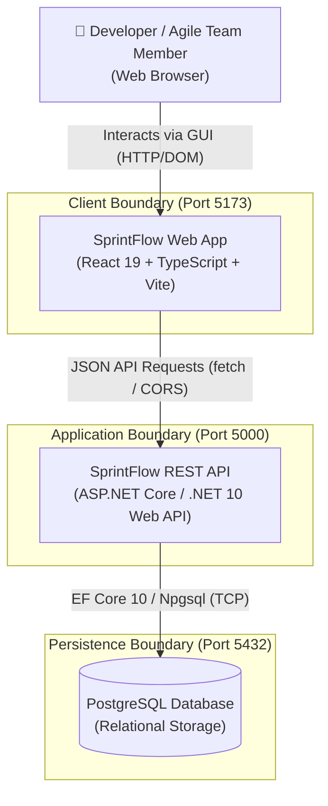

### Context Summary
- **Client Boundary**: Single Page Application (SPA) running in the user's browser, responsible for presentation and local interaction.
- **Application Boundary**: Stateless ASP.NET Core Web API enforcing business rules, entity orchestration, and validation.
- **Persistence Boundary**: PostgreSQL instance guaranteeing ACID compliance, relational integrity, and persistent storage.
- No external third-party SaaS, message brokers, or caching proxies are utilized in the current system.

---

## 2. High-Level Architecture Diagram

SprintFlow enforces a strict, layered architectural style where dependencies only flow downward.

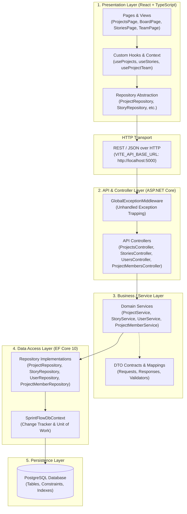

### Why This Layering Exists
1. **Separation of Concerns**: Controllers only handle HTTP concerns (status codes, model binding), Services handle domain rules, Repositories handle data access.
2. **Testability**: Any layer can be unit-tested in isolation by mocking the interface below it.
3. **Storage Independence**: The data access layer encapsulates EF Core; services and controllers remain agnostic to SQL query mechanics.

---

## 3. Component Diagram

This diagram displays the key structural components across the frontend, backend, and database packages.

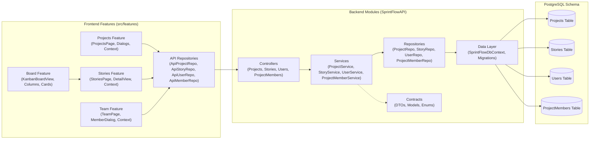

---

## 4. End-to-End Request Lifecycle

Traces a request from user action through the entire technology stack and back to the rendered view.

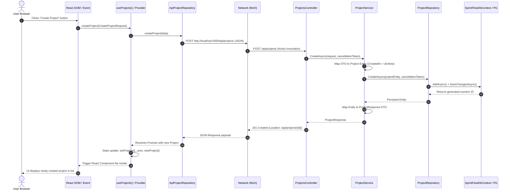

---

## 5. Frontend Data Flow

Shows how local state and asynchronous operations are isolated inside React Context Providers and custom hooks.

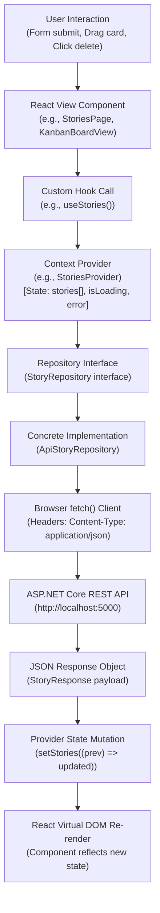

---

## 6. Project Creation Sequence Diagram

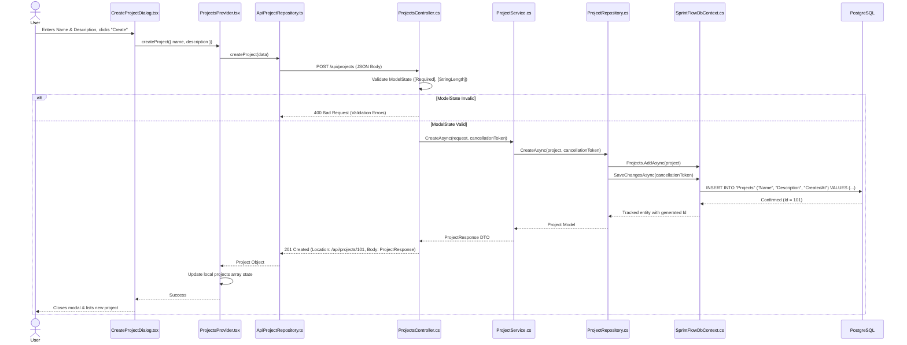

---

## 7. Story Creation Sequence Diagram (Business Validation)

Demonstrates the service layer performing domain validations (project existence, user existence, project team membership) before executing persistence.

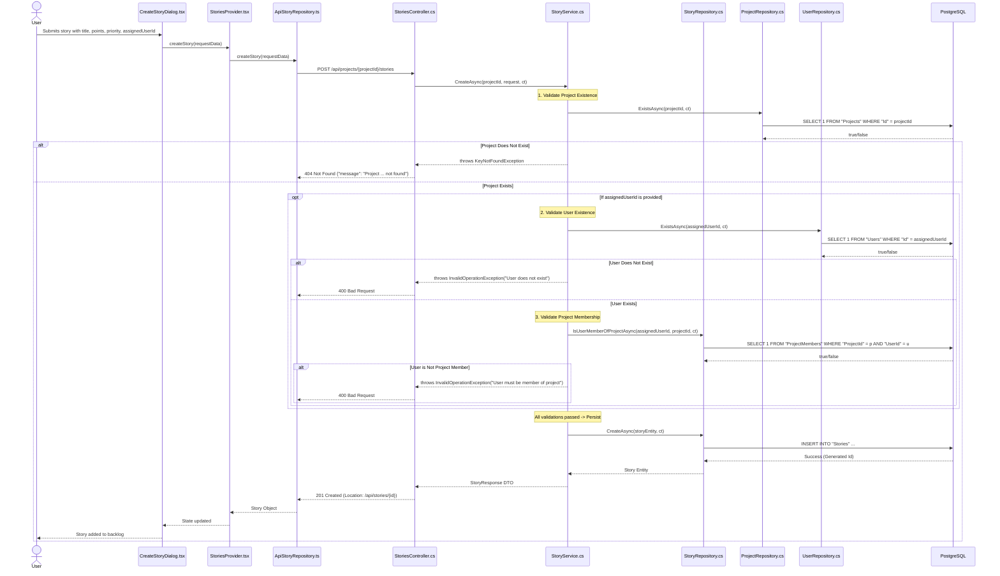

---

## 8. Project Member Sequence Diagram (Duplicate Prevention)

Shows `ProjectMemberService` enforcing duplicate membership prevention and returning `409 Conflict`.

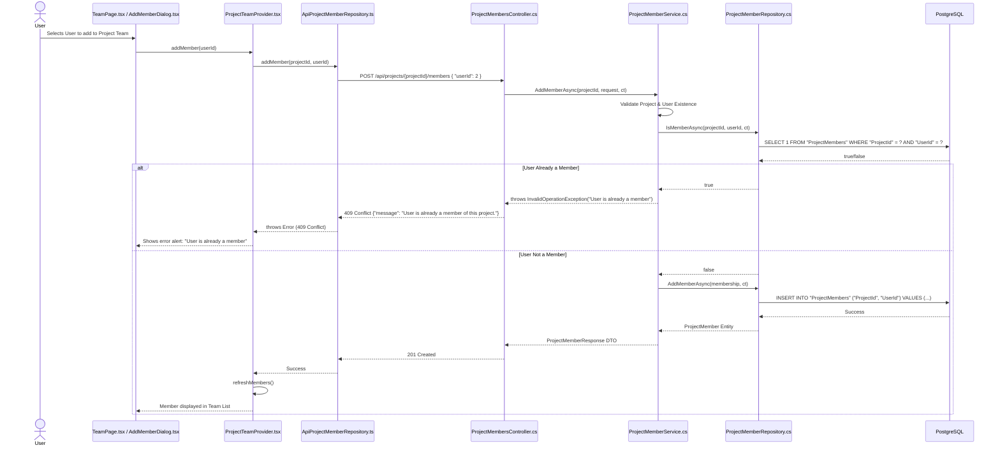

---

## 9. Story Assignee Business Rule Flow

Flowchart depicting the exact decision tree in `StoryService.ValidateAssigneeForProjectAsync()`.

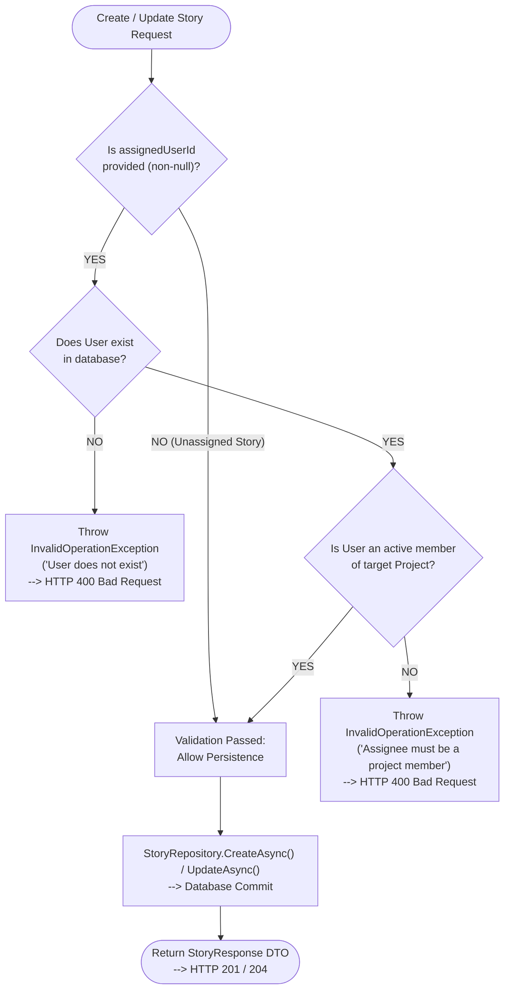

---

## 10. User Delete Sequence & Relational Integrity

Visualizes database-level cascades and nullification when a User entity is deleted.

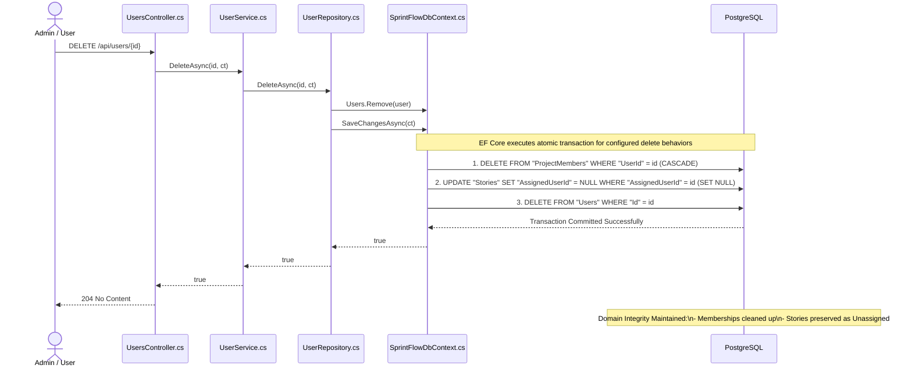

---

## 11. Database Entity Relationship Diagram (ERD)

Physical schema representation reflecting EF Core `OnModelCreating` configuration and PostgreSQL database tables.

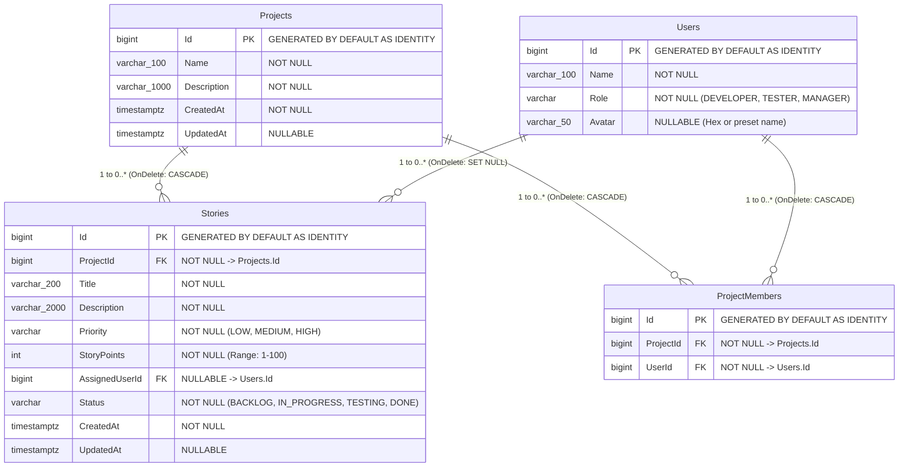

---

## 12. Domain Model / UML Class Diagram

Conceptual domain entity design in C# backend, showing models, enums, and relationships.

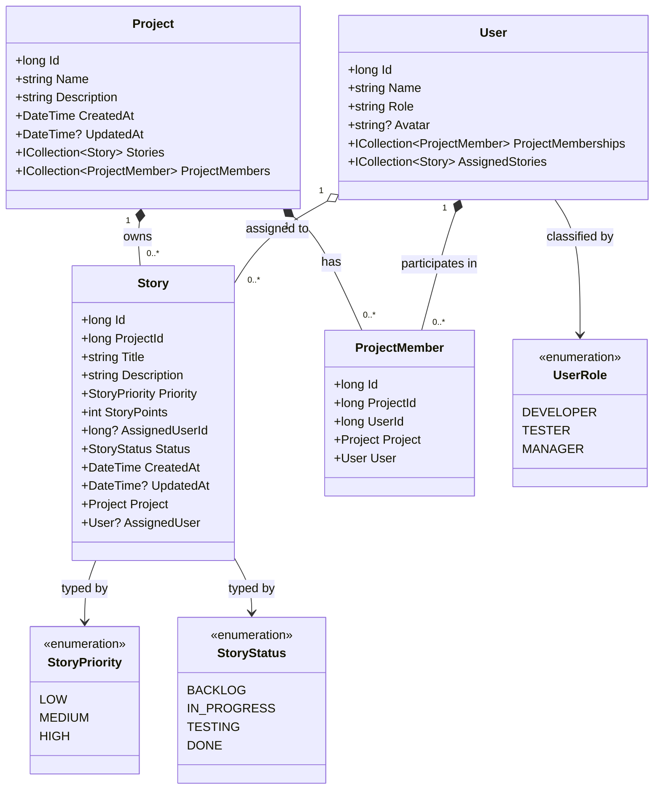

---

## 13. Transaction & Unit of Work Persistence Model

Contrasts standard single-operation CRUD execution with multi-step explicit transaction boundaries.

```mermaid
graph TD
    subgraph StandardCRUD["Standard CRUD Pattern (Implemented in SprintFlow)"]
        S1["Service Operation"] --> R1["Repository Operation\n(_context.Entity.AddAsync / Remove)"]
        R1 --> CT1["DbContext ChangeTracker\n(Marks entity Added / Modified / Deleted)"]
        CT1 --> SC1["SaveChangesAsync(cancellationToken)"]
        SC1 --> TX1["EF Core Internal Transaction\n(Automatic BEGIN ... COMMIT on success / ROLLBACK on fail)"]
        TX1 --> PG1[("PostgreSQL\nAtomic persistence of tracked changes")]
    end

    subgraph ExplicitTransaction["Explicit Transaction Pattern (Reserved for Multi-Step Workflows)"]
        S2["Complex Multi-Service Workflow"] --> B2["await _context.Database.BeginTransactionAsync()"]
        B2 --> R2A["Repository A -> SaveChangesAsync()"]
        R2A --> R2B["Repository B -> SaveChangesAsync()"]
        R2B --> C2{"All steps\nsucceeded?"}
        C2 -- "YES" --> CM2["await transaction.CommitAsync()"]
        C2 -- "NO (Exception)" --> RB2["await transaction.RollbackAsync()\n(Zero partial data committed)"]
    end
```

> **Engineering Principle**: SprintFlow's CRUD operations rely on `SaveChangesAsync()`'s built-in transaction behavior. Explicit transactions (`BeginTransactionAsync`) are not needed for single-table operations, preventing unnecessary connection locking and overhead.

---

## 14. CancellationToken Propagation Flow

Demonstrates cooperative async task cancellation across all architectural tiers.

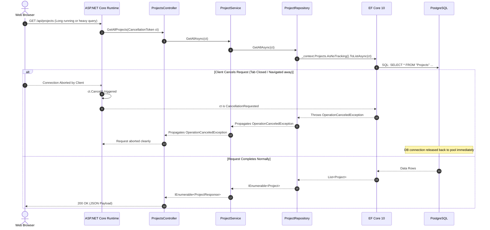

> **Note**: `CancellationToken` provides **cooperative asynchronous cancellation**. It stops redundant computation when clients disconnect; it is distinct from database transaction rollback.

---

## 15. Error Propagation & Exception Handling Flow

Shows how different errors are mapped to specific HTTP status codes and handled on the frontend.

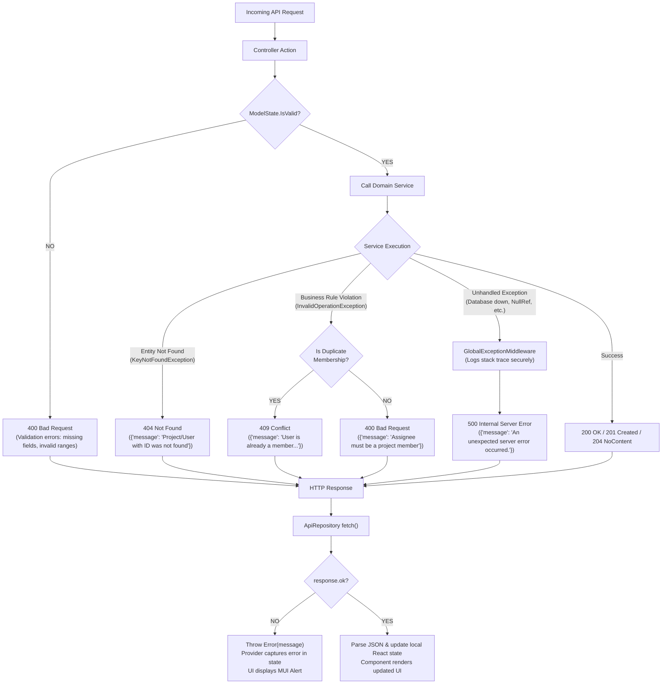

---

## 16. Frontend Repository Abstraction

Illustrates how TypeScript interfaces decouple UI components from the HTTP network layer.

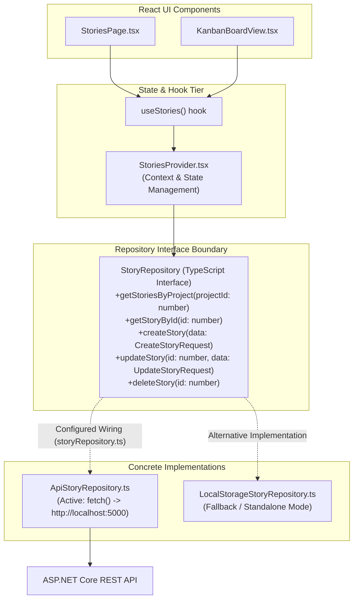

---

## 17. Deployment Topology (Local Development)

Visualizes the process and port architecture during local development execution.

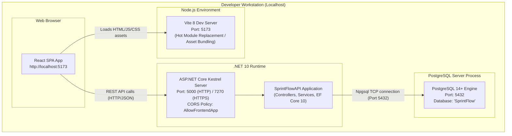

---

## 18. Architectural Concepts Illustrated

The diagrams in this document illustrate the core architectural concepts of SprintFlow:

| Diagram | Primary Engineering Concept |
|---|---|
| **System Context (§1)** | System boundaries and external actor interactions |
| **High-Level Architecture (§2)** | Downward dependency flow and strict layer decoupling |
| **Component Diagram (§3)** | Package structure and cross-boundary dependencies |
| **Request Lifecycle (§4)** | End-to-end request-response cycle from DOM event to SQL query |
| **Frontend Data Flow (§5)** | React Context and custom hook state isolation |
| **Project Creation Sequence (§6)** | REST resource creation with `201 Created` and Location header |
| **Story Creation Sequence (§7)** | Cross-entity business validation inside the Service layer |
| **Member Sequence (§8)** | Duplicate constraint enforcement returning `409 Conflict` |
| **Story Assignee Flow (§9)** | Domain decision tree for project-scoped story assignments |
| **User Delete Sequence (§10)** | Multi-table relational cascade (`CASCADE` vs `SET NULL`) |
| **Database ERD (§11)** | Physical schema constraints, identity PKs, and foreign keys |
| **Domain Model (§12)** | C# entity relationships and enum typing |
| **Transaction Model (§13)** | EF Core `SaveChangesAsync()` implicit transactions vs explicit boundaries |
| **CancellationToken Flow (§14)** | Cooperative async task cancellation preventing connection leaks |
| **Error Handling Flow (§15)** | Exception-to-HTTP-status mapping and frontend error state capture |
| **Repository Abstraction (§16)** | Interface-based decoupling of presentation from transport |
| **Deployment Topology (§17)** | Multi-tier local process execution model |

---

*For detailed code-level explanations and design rationale, refer to [architecture.md](architecture.md), [database.md](database.md), and [api.md](api.md).*
